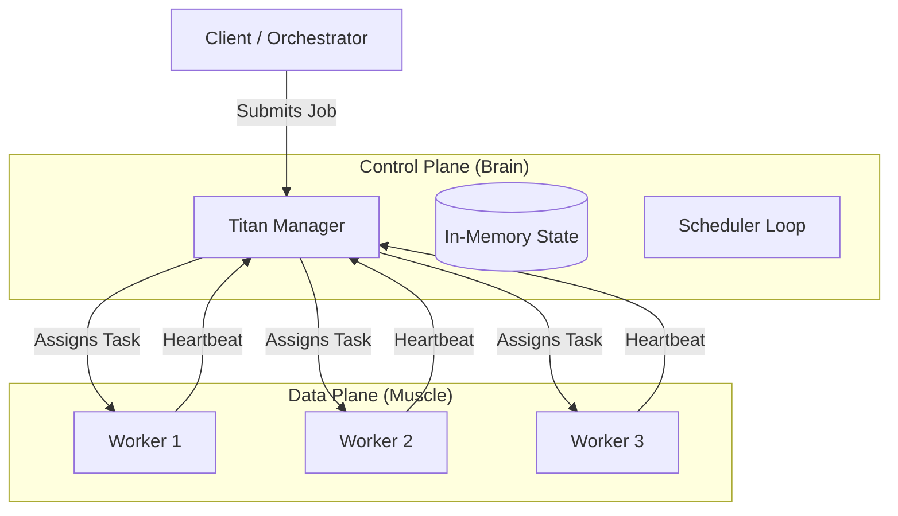

# Titan: Distributed Job Scheduler
## A High-Performance Distributed Systems Architecture

---

# 1. The Problem: Why Distributed?

### The Challenge
Modern computational tasks are too heavy for a single machine:
- **Big Data Processing** (ETL)
- **Scientific Computing** (Fractals, Weather Simulation)
- **Video Rendering**
- **Microservices Orchestration**

### The Solution
Instead of one "Super Computer", use **many smaller computers** working in harmony.

### Enter Titan
**Titan** is an orchestration platform that turns a cluster of dumb machines into a single smart supercomputer.

---

# 2. High-Level Architecture

Titan follows the **Control Plane / Data Plane** separation pattern used by Kubernetes and Google Borg.



---

# 3. Core Concepts

### 🧠 The Manager (Control Plane)
The "Boss". It doesn't do any heavy lifting.
- **Responsibilities:**
  - Accepts jobs from users.
  - Monitors worker health.
  - Decides *who* runs *what* (Scheduling).
  - Stores the state of the cluster.

### 💪 The Worker (Data Plane)
The "Laborer". It executes commands blindly.
- **Responsibilities:**
  - Executes generic OS commands.
  - Spawns isolated processes.
  - Captures `stdout` / `stderr`.
  - Reports status contentiously.

---

# 4. How It Works: The Lifecycle of a Job

1.  **Submission**: User submits a job (e.g., "Render Fractal Tile 1").
    - State: `PENDING`
2.  **Scheduling**: The **Scheduler Loop** wakes up (every 5s).
    - Finds a `PENDING` job.
    - Finds a `HEALTHY` worker (Round-Robin).
    - State: `SCHEDULED`
3.  **Dispatch**: Manager sends `StartTask` RPC to the Worker.
4.  **Execution**: Worker spawns a subprocess.
    - State: `RUNNING`
5.  **Completion**: Process exits (Success/Failure).
    - Worker reports back to Manager.
    - State: `COMPLETED`

---

# 5. Key Technical Features

### 📡 Heartbeating (Fault Tolerance)
**Problem:** What if a worker crashes (power cut, network fail)?
**Solution:** Active Heartbeats.
- Workers send a "I'm alive" signal every **10 seconds**.
- Manager tracks `LastHeartbeat` timestamp.
- If no heartbeat for **30 seconds**, Manager marks worker `UNHEALTHY` and stops sending it work.

### ⚡ RPC Communication
We use **Go's net/rpc** (over TCP) for communication.
- **Faster** than REST/HTTP (binary encoding).
- **Type-Safe** (Go structs ensure correctness).
- **Efficient** (Persistent TCP connections).

### 🔄 Concurrency Model
Built entirely on Go's primitives:
- **Goroutines**: For handling requests and running tasks without blocking.
- **Channels**: For graceful shutdown signals.
- **Mutexes**: For thread-safe state management in the Manager.

---

# 6. Real-World Use Case: Distributed Fractal Rendering

To prove Titan isn't a toy, we implemented a **Mandelbrot Rendering Farm**.

### The Workload
- **Task**: Render a 4096 x 4096 pixel image of the Mandelbrot set.
- **Intensity**: Requires billions of complex number calculations.

### The Distribution Strategy (Map-Reduce)
1.  **Split**: An Orchestrator splits the image into **16 tiles**.
2.  **Map**: Titan distributes these 16 jobs across 4 Workers.
3.  **Execute**: Workers render tiles in parallel (4x speedup).
4.  **Result**: 16 high-res PNG files generated.

---

# 7. Code Walkthrough (Principal-Level Patterns)

### The Scheduler Loop
*Clean, decoupled logic running in the background.*
```go
func (s *Scheduler) Run() {
    ticker := time.NewTicker(5 * time.Second)
    for {
        select {
        case <-ticker.C:
            s.schedule() // The core logic
        case <-s.stopChan:
            return
        }
    }
}
```

### Thread-Safe Storage
*Using RWMutex to allow massive concurrent reads while protecting writes.*
```go
func (s *Store) AddJob(job *models.Job) {
    s.mu.Lock()         // Exclusive Write Lock
    defer s.mu.Unlock()
    s.jobs[job.ID] = job
}
```

---

# 8. Future Roadmap

If this were going to production (V2):

1.  **Persistence**: Add a Write-Ahead Log (WAL) so Manager survives restarts (like Postgres).
2.  **Consensus**: Use **Raft** to have 3 Managers (High Availability) so the "Brain" never dies.
3.  **Smart Scheduling**: Use Bin-Packing to put tasks on workers with the most free RAM/CPU.
4.  **Security**: mTLS encryption between nodes.

---
# Summary

**Titan** demonstrates:
- ✅ **Distributed Systems Mastery**
- ✅ **Production-Grade Go Code**
- ✅ **Real Computational Utility**

*Ready for Q&A*
