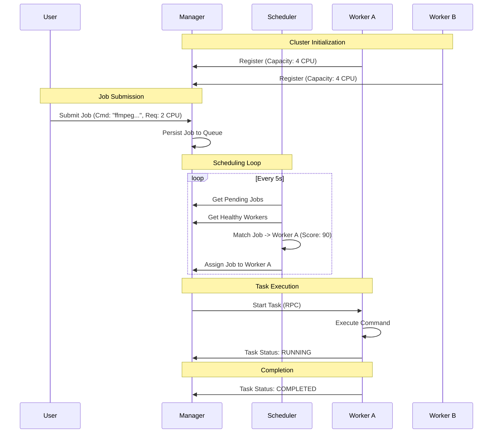
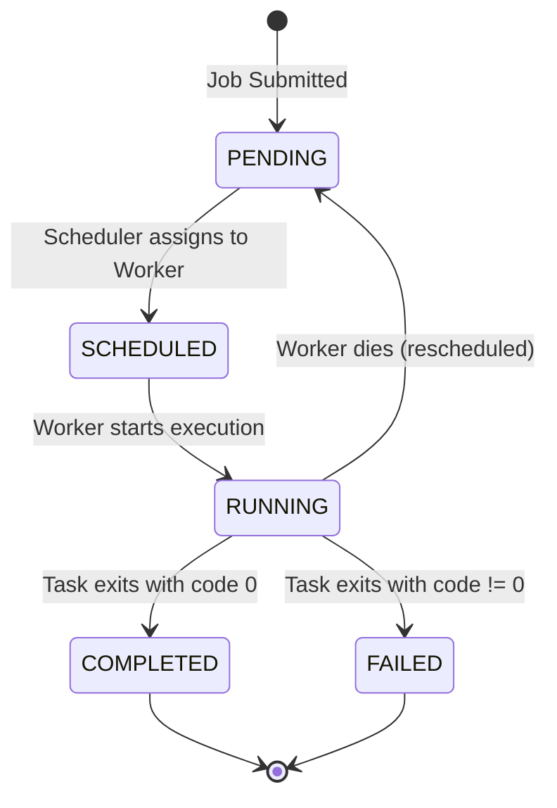

# Titan: Distributed Job Scheduler Architecture

## 1. System Overview

Titan is a distributed job scheduler modeled after Google's Borg, HashiCorp's Nomad, and Kubernetes. It orchestrates the execution of tasks across a cluster of worker nodes.

The system consists of two primary node types:
1.  **Manager (Server):** The brain of the cluster. Responsible for accepting jobs, scheduling them, and managing cluster state.
2.  **Worker (Client):** The muscle. Responsible for executing tasks and reporting health/status back to the Manager.

## 2. Core Concepts

*   **Job:** A unit of work submitted by a user. Contains a command to run (e.g., `echo "hello"`), resource requirements (CPU/RAM), and an ID.
*   **Task:** An instance of a running Job.
*   **Scheduler:** The component within the Manager that decides *where* a Task should run based on Worker availability.
*   **Heartbeat:** A periodic signal sent by Workers to the Manager to indicate liveness.

## 3. Data Flow & Component Interaction

### Mermaid Diagram

## 4. Component Design

### 4.1. The Manager
*   **API Server:** gRPC endpoint for Users (SubmitJob) and Workers (Register, Heartbeat).
*   **Scheduler:** A control loop that checks for unscheduled jobs and assigns them to nodes.
    *   *Algorithm:* Round-Robin (Phase 1), Resource-Weighted (Phase 2).
*   **WorkerManager:** Tracks the state of all workers (Healthy, Unhealthy, Disconnected).

### 4.2. The Worker
*   **TaskEngine:** Responsible for spawning OS processes.
*   **StatsCollector:** Monitors local resource usage (CPU/Memory).
*   **Heartbeater:** Sends `Pulse()` RPCs to the Manager every $N$ seconds.

## 5. API Surface (gRPC)

We use Protocol Buffers for strict typing and performance.

### Service: `ManagerService`
*   `SubmitJob(JobRequest) returns (JobResponse)`
*   `GetJobStatus(JobId) returns (JobStatus)`
*   `ListJobs(ListJobsRequest) returns (ListJobsResponse)`

### Service: `WorkerService`
*   `RegisterWorker(WorkerInfo) returns (RegistrationResponse)`
*   `Heartbeat(HeartbeatRequest) returns (HeartbeatResponse)`
*   `StartTask(TaskRequest) returns (TaskResponse)`
*   `StopTask(StopTaskRequest) returns (StopTaskResponse)`
*   `ReportTaskStatus(TaskStatusUpdate) returns (Ack)`

## 6. State Flow Diagram

## 7. Design Trade-offs

### Consistency vs. Availability (CAP Theorem)
*   **Decision:** We prioritize **Availability** over **Consistency**.
*   **Rationale:** If the Manager goes down, Workers continue running their current tasks (Partition Tolerance), but new jobs cannot be scheduled until the Manager returns. This is acceptable for a job scheduler where eventual consistency is sufficient.
*   **Alternative Considered:** Using Raft consensus for a highly-available Manager cluster. Rejected for PoC complexity.

### State Management
*   **Decision:** In-memory state with Write-Ahead Log (WAL).
*   **Rationale:** Provides fast lookups and simple crash recovery without the operational overhead of etcd/Consul.
*   **Trade-off:** Single point of failure (no multi-region redundancy). Mitigated by WAL for single-node recovery.

### Scheduling Algorithm
*   **Decision:** Round-robin for MVP, resource-weighted for future iteration.
*   **Rationale:** Round-robin is simple and provides good load distribution when tasks are homogeneous.
*   **Trade-off:** Inefficient with heterogeneous workloads (large tasks on small workers). Future improvement: bin-packing algorithm.

## 8. Failure Modes & Mitigation

| Failure Mode | Detection | Mitigation |
|--------------|-----------|------------|
| Worker crash | Heartbeat timeout (30s) | Mark worker unhealthy, reschedule tasks |
| Manager crash | N/A (single instance) | Replay WAL on restart to restore state |
| Network partition | gRPC connection error | Retry with exponential backoff |
| Task timeout | Worker-side timeout | Kill process, report FAILED status |

## 9. Performance Characteristics

*   **Expected Throughput:** 1000+ jobs/second (limited by gRPC overhead)
*   **Scheduling Latency:** <100ms (single-threaded scheduler)
*   **Worker Capacity:** 100+ workers per Manager
*   **Task Execution Overhead:** ~10ms (process spawn time)

## 10. Future Enhancements

1.  **Multi-Manager HA:** Use Raft consensus for leader election
2.  **Horizontal Scaling:** Shard job queue across multiple Managers
3.  **Advanced Scheduling:** Constraint-based placement (affinity, anti-affinity)
4.  **Observability:** Prometheus metrics, distributed tracing
5.  **Job Dependencies:** DAG-based workflow support
